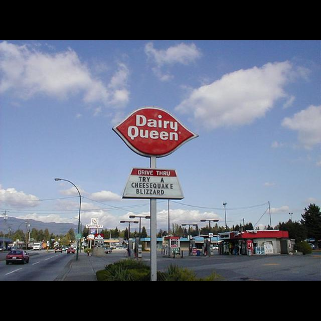
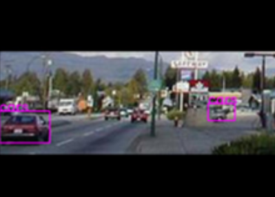
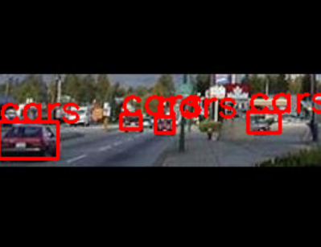

# Drop and Crop - handling extremely small bounding boxes in Pascal VOC format
Note: This script is created for image dataset with annotations in XML format (pascal VOC format).

Including images with extremely small bounding boxes could be an issue when used in object detection model.

The function `get_small_bbox_list(area_thresh, XML_PATH)` returns a list of image filenames of which the bounding boxes in the entire image are no larger than the area treshold passed in. Hence, we can safely filter out these images, for further processing or maybe discard them.

On the other hand, if an image has a wide range of bounding box area sizes (including the extremely small ones of course), it would not be as straight forward as filtering them out. There are different ways to deal with this, and one of them is to remove these extremely small bounding boxes and then crop out the remaining images. In short, we are excluding part of the images where these extremely small bounding boxes are located.

However, if a small bounding box is between 2 larger bounding boxes, dropping and cropping it out will cause missing annotations, as shown in the second image below:

*Original image:*

*Drop and crop image -- missing annotations:*

*Drop and crop image -- keeping annotations in between:*

The main function in this script `drop_crop_small_bbox()` does not remove any small bounding boxes between any larger ones!

## Running of Script
Run python file in terminal - if the bounding box area is lesser than the area threshold passed in, it will be removed

`python small_bbox.py --area 400 --imgpath ./path/to/images --annpath ./path/to/annotations`